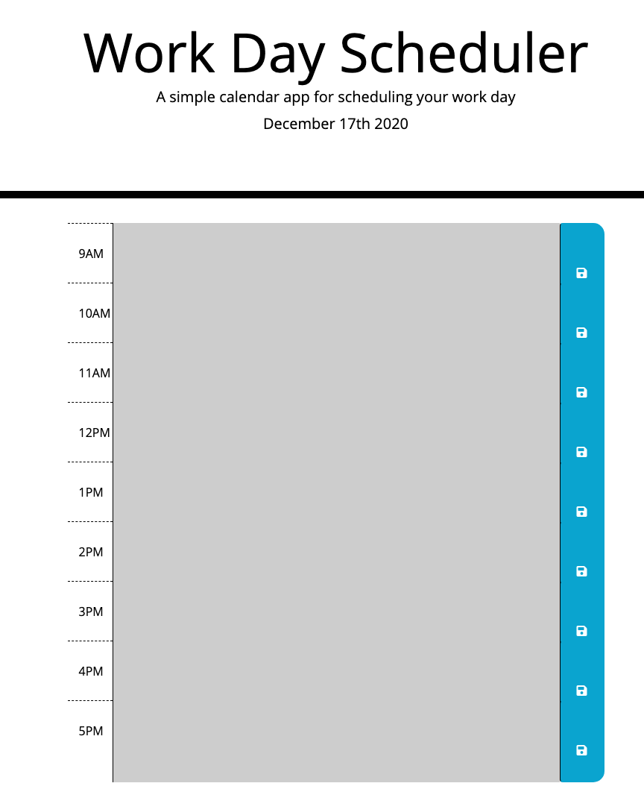

# work-day-scheduler
This is a daily planner with standard business hours (9am - 5pm). This template was created using JavaScript, Bootstrap and jQuery. 

Moment JS was used to set the current date displayed inside Bootstrap's Jumbotron feature. The following code was made using Moment JS: 

```js
var currentDay = moment().format("MMMM Do YYYY");
$("#currentDay").text(currentDay);
``` 

The 
```js 
moment().format("MMM Do YYYY")
```
was taken form the Moment JS website and modified with the rest of the code around it to fit into the js.




Deployed URL: https://claudialhc.github.io/work-day-scheduler/

